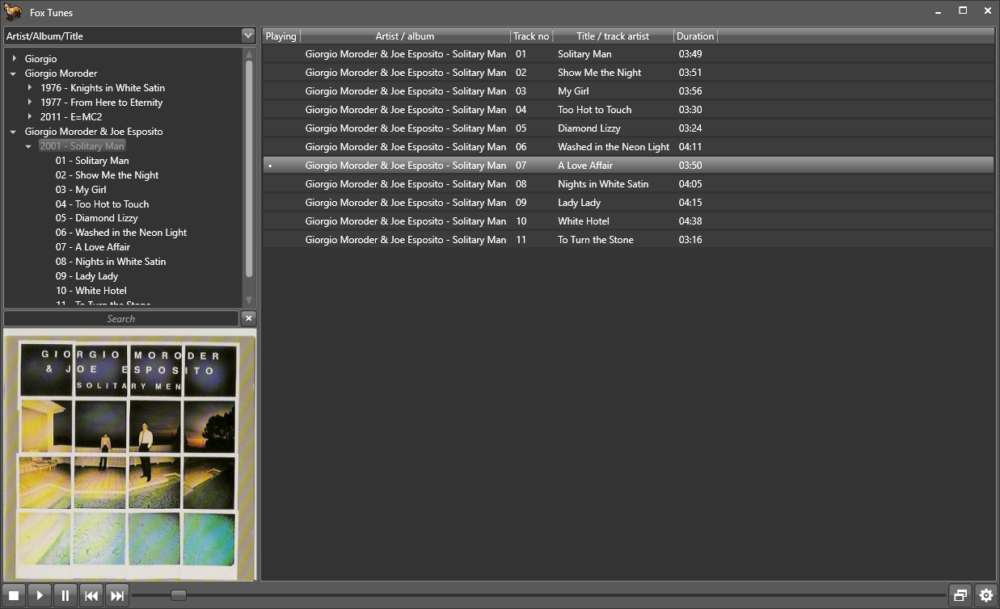
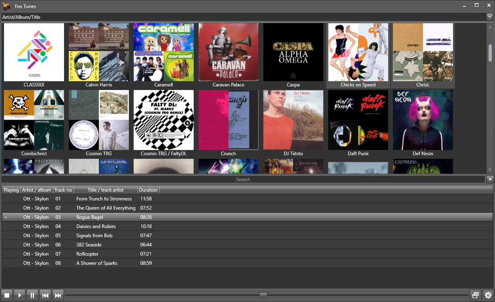
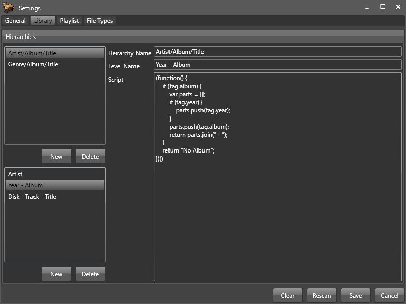
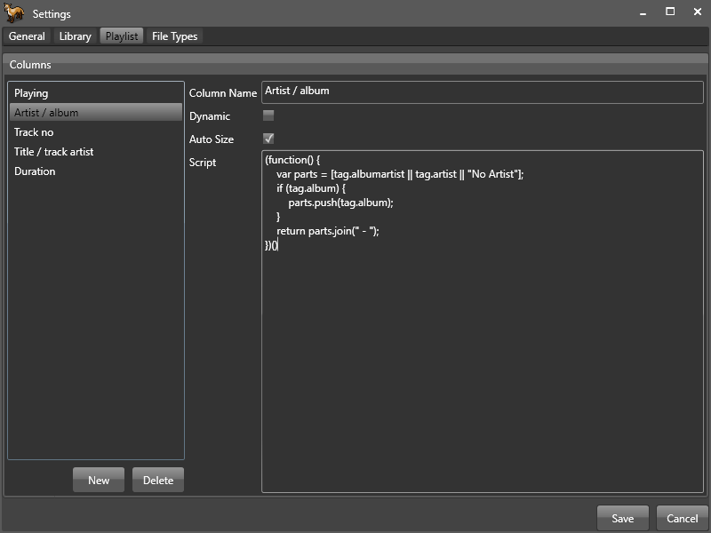
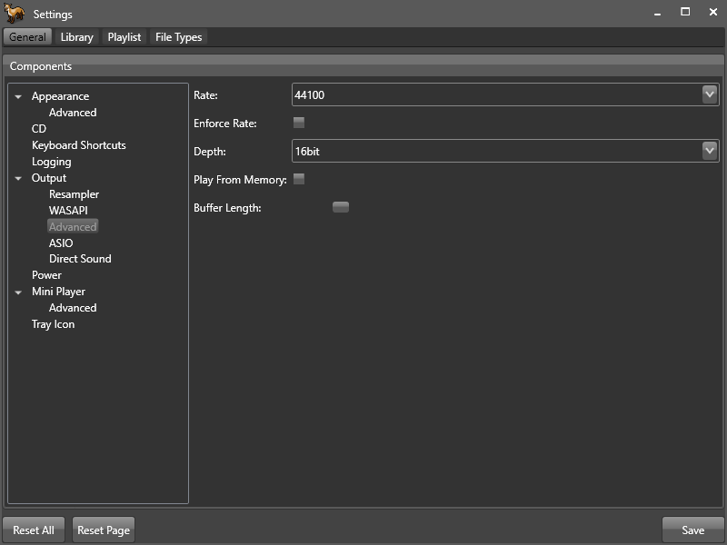
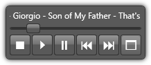
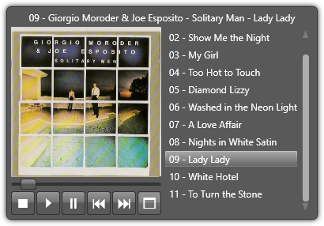

# FoxTunes
A modular music player and converter using the BASS framework.

The main release is [FoxTunes-2.2.1-net461-x86.zip](https://github.com/aidan-g/FoxTunes/releases/download/2.2.1/FoxTunes-2.2.1-net461-x86.zip)
There is also a [Microsoft Store](https://www.microsoft.com/store/productId/9MWPJTXWTXLG) package.

The wiki is [FoxTunes-wiki](https://github.com/aidan-g/FoxTunes/wiki)

* The following input formats are supported: aac, ac3, aif, ape, dff, dsf, dts, fla, flac, kar, m4a, m4a, m4b, mac, mid, midi, mp1, mp2, mp3, mp4, oga, ogg, ogg, opus, rmi, wav, wma, wv
* The following output formats are supported: flac, m4a, mp3, ogg, opus, wv
* Cue sheets can be played and split using the converter.
* 64 bit builds are available.

The UI components can be relocated and removed.

Library, playlist and other elements can be customized using Javascript.

DirectSound, ASIO and WASAPI output modes are supported.

Includes a mini player with optional artwork and playlist.

Can be used with file associations and the "Send to" explorer action. 

A Windows XP compatibile .NET 4.0 build is available, can be configured minimally.
It needs at least;
* [KB2468871](https://www.microsoft.com/en-us/download/details.aspx?id=3556) - Portable class libraries patch.
  * Microsoft keep breaking the link. Google: NDP40-KB2468871

Themable. You can create a theme library with xaml. See the FoxTunes.UI.Windows.Themes project for an example.
Two are included. I'm no artist;
* Expression Dark - A style developed by Microsoft. 
* System - Use the default appearance. Minimal resource usage.

Various optional plugins are available;

* ASIO - Low latency exclusive output, supports DSD direct.
* CD - Play audio CDs from a physical drive.
* CROSSFADE - A fading input transport: https://github.com/aidan-g/BASS_CROSSFADE
* CUE - Play cue sheets.
* DSD - Required for DSD direct.
* DTS - Play .dts multi channel format: https://github.com/aidan-g/BASS_DTS
* DirectSound - Use standard windows audio session for output.
* Encoder - A converter with various output formats. 
  * Can split cue sheets with the CUE plugin.
  * Can rip CDs with the CD plugin.
  * Can up/down sample rate/depth with the Resampler plugin.
* GAPLESS - A "true" gapless input transport: https://github.com/aidan-g/BASS_GAPLESS
* Javascript - Use JS for scriptable elements.
* Layout - A flexible layout system with various panel types: 
* LibraryBrowser - An album art grid interface for the library. It can use lots of memory.
* Logging - Use Log4Net logging back-end. Can be configured and disabled.
* MetaDataEditor - A simple batch mode tag editor. Can embed artwork.
* MOD - Play various mod music formats.
* ParametricEqualizer - A ten band parametric equalizer.
* ReplayGain - Canculate and utilize replay gain meta data for tracks and albums: https://github.com/aidan-g/BASS_REPLAY_GAIN
  * Can calculate on demand (per track) if you don't mind waiting a moment for playback.
* Ratings - 1-5 based star rating system with several controls for viewing and editing.
* Resampler - SOXR based high quality configurable resampler. Can perform up/down sampling: https://github.com/aidan-g/BASS_SOX
* SQLite - Use SQLite for database functions.
* SimpleMetaData - A meta data provider using the file path and regular expressions. Recommended for older systems.
* Spectrum - A simple spectrum visualization.
* SqlServer - Use Microsoft SQL Server for database functions.
* Statistics - Playback statistics like play count and last played date/time.
* TagLib - Use TagLib for meta data functions.
* WASAPI - Windows Audio Session API output.
* WaveBar - A wave form seek bar with mono and multi channel modes.
* Windows - Global key bindings (Multi media keys), system tray icon, system media transport controls, taskbar controls.

I'm saving up for a signing certificate and associated costs but it is very expensive;

