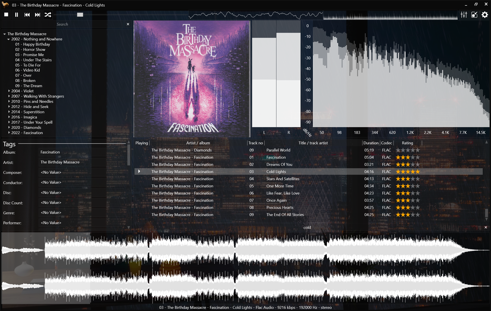
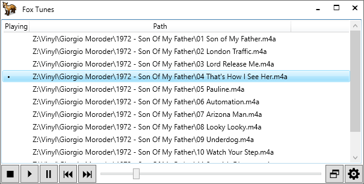

# FoxTunes
A **portable, modular music player and converter** using the BASS framework for Windows XP/.../10/11.

The main release is [FoxTunes-3.6.0-net48.zip](https://github.com/pudding-fox/FoxTunes/releases/download/3.6.0/FoxTunes-3.6.0-net48.zip).  
For additional plugins, download [FoxTunes-3.6.0-Plugins-net48.zip](https://github.com/pudding-fox/FoxTunes/releases/download/3.6.0/FoxTunes-3.6.0-Plugins-net48.zip) (extract and copy required folders to the FoxTunes\lib directory).

There is also a [Microsoft Store](https://www.microsoft.com/store/productId/9MWPJTXWTXLG) package.

## Input/Output

* The following **input formats** are supported: aac, ac3, aif, ape, dff, dsf, dts, fla, flac, kar, m4a, m4a, m4b, mac, mid, midi, mod, mp1, mp2, mp3, mp4, oga, ogg, ogg, opus, rmi, wav, wma, wv.
* The following **output formats** are supported: flac, m4a, mp3, ogg, opus, wv.
* Gapless and fading (with crossfading) **input modes** are supported.
* DirectSound, WASAPI and ASIO **output modes** are supported.
* 10 band equalizer with build in and custom presets.
* Tempo control.
* A high quality resampler based on the soxr library.
* Cue sheets can be played and split using the converter.
* Various archive files can be played directly.

## Interface/Layout

The user interface can be customized. A flexible layout system is included with split panels, tabs and other containers.
Several layout presets are included.
You can save and switch between different layouts by activating in the settings '**Profiles**'.  
Additional windows can be added and customized.

## Scriptable

Library, playlist and other elements can be customized using Javascript.

## Themable

Our default style is a dark flat appearence called Adamantine

Several other styles by Microsoft are available:
* Expression Dark
* Aero
* Aero 2
* Classic
* Royale

## Mini player

Includes a mini player with optional artwork and playlist.

## Settings

We try to make functionality as flexible and configurable as possible.
Unfortunately this is often at the expense of ease of use.
Many areas have context (right click) menus exposing additional features and settings.

## Mini Disc

A mini disc plugin is included and can be activated in the settings screen.
If you have a supported NET MD device, physical disks can be created and modified.

## Windows XP support

A Windows XP compatibile .NET 4.0 build can be created. Use the net40 target.

It needs at least;
* [KB2468871](https://www.microsoft.com/en-us/download/details.aspx?id=3556) - Portable class libraries patch.
  * Microsoft keep breaking the link. Google: NDP40-KB2468871
* [Windows Imaging Component (x86)](http://www.microsoft.com/downloads/details.aspx?FamilyID=8E011506-6307-445B-B950-215DEF45DDD8)
* [Windows Imaging Component (x64)](http://www.microsoft.com/downloads/details.aspx?familyid=F64654AC-6E26-41D9-A90A-0E7783B864EE)
  * Microsoft keep breaking the links. Google: Windows Imaging Component

## Optional plugins

* **Archive** - Tracks can be played directly from some archive formats: 7z, iso, rar, tar and zip.
* **ASIO** - Low latency exclusive output, supports DSD direct.
* **CD** - Play audio CDs from a physical drive.
* **CROSSFADE** - A fading input transport.
* **CUE** - Play cue sheets.
  * Provides the "skip silence" feature which can trim silence from the start and end of media.
* **Discogs** - Fetch meta data and images using the discogs API.
  * Automatically fetch missing artwork.
* **DirectSound** - Use standard windows audio session for output.
* **DSD** - Required for DSD direct.
* **DTS** - Play .dts multi channel format.
* **Encoder** - A converter with various output formats. 
  * Can split cue sheets with the CUE plugin.
  * Can rip CDs with the CD plugin.
  * Can up/down sample rate/depth with the Resampler plugin.
* **GAPLESS** - A "true" gapless input transport.
* **GroupedPlaylist** - A scriptable playlist with grouping and artwork. 
* **Noesis** - Use Noesis.Javascript for scriptable elements.
* **ClearScript** - Use Microsoft.ClearScript for scriptable elements.  
* **Layout** - A flexible layout system with various panel types. 
* **LibraryBrowser** - An album art grid interface for the library.
* **Logging** - Use Log4Net logging back-end. Only used for debugging.
* **Lyrics** - A simple lyrics viewer, editor and auto lookup via "Chart Lyrics" provider.
* **Memory** - Play tracks from memory.
  * Improves playback over a network or other slow storage.
* **MetaDataEditor** - A simple batch mode tag editor. Can embed artwork.
* **MetaDataViewer** - A simple meta data viewer.
* **Minidisc** - Write physical minidiscs using a compatible netmd device.
* **MOD** - Play various mod music formats.
* **ParametricEqualizer** - A ten band parametric equalizer with EQ presets easily modifiable and addable (TEXT files).
* **Ratings** - 1-5 based star rating system with several controls for viewing and editing.
* **ReplayGain** - Calculate and utilize replay gain meta data for tracks and albums.
  * Can calculate on demand (per track) if you don't mind waiting a moment for playback.
* **Resampler** - SOXR based high quality configurable resampler. Can perform up/down sampling.
* **Snapping** - Enable winamp like window snapping.
* **Visualizations** - Visualizations: Spectrum, Peak Meter, Oscilloscope and Spectrogram.
* **SQLite** - Use SQLite for database functions.
* **Statistics** - Playback statistics like play count and last played date/time.
* **TagLib** - Use TagLib for meta data functions.
* **Tempo** - Adjust the tempo and pitch of media.
* **Tools** - A framework for external tools.
  * Open media with MusicBrainz Picard.
* **WASAPI** - Windows Audio Session API output.
* **WaveBar** - A wave form seek bar with mono and multi channel modes.
* **Windows** - Global key bindings (Multi media keys), system tray icon, system media transport controls, taskbar controls, toast notifications.
* **WPF** - Used for UI themes.

## Translations

For now only English and French translations are available.  
Please help us to translate FoxTunes in your language by submitting a pull request.

## Support the project

~We are saving up for a signing certificate and associated costs but it is very expensive.~ it's unlikely this will ever happen but I try to update the windows store app regularly which seems to address AV false positives to some extent. 

